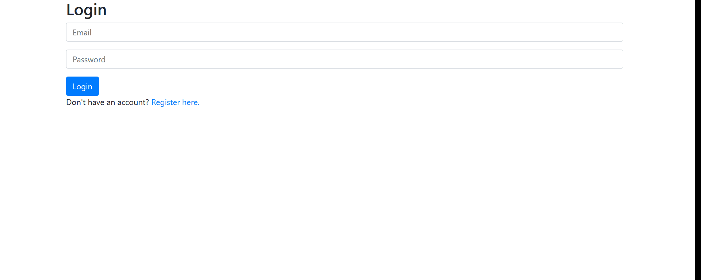
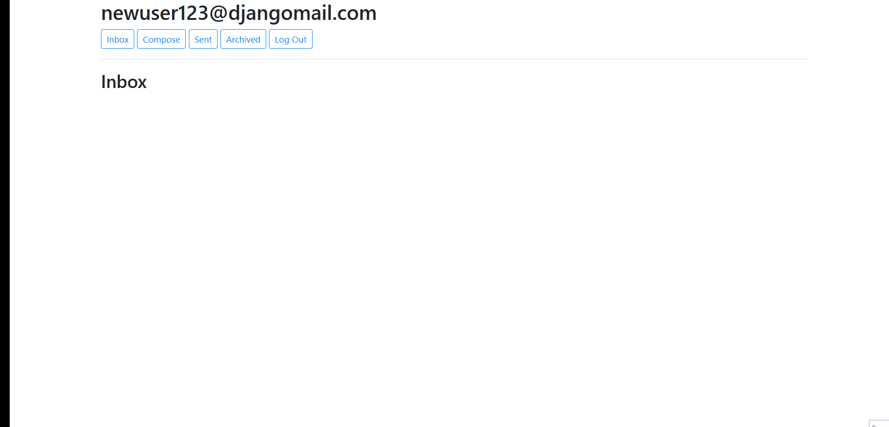
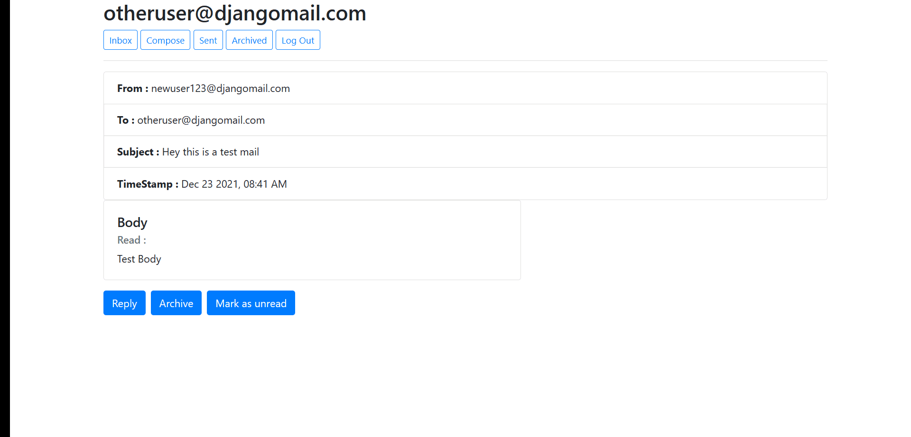

<h1 align="center">Django Mail</h1>

> Django Mail is a web application where user can create account and send or recieve emails on that account. 

## Features Demo : 
#### 1. Authentication
> Its uses email-password authentication of django where user can login or register to access their emails

#### 2. Email Funcionality
>Implemented URL Routes with different request types to performs actions like sending or receiving emails, marking them as read/unread, or archive emails.

### 3. Different Mail Boxes : 
> Mails are stored in sepeate mail boxes according to their mark : sent, recieved, archived.

# How to run?
1. Clone this repository
2. Simply run : `Python manage.py runserver`

